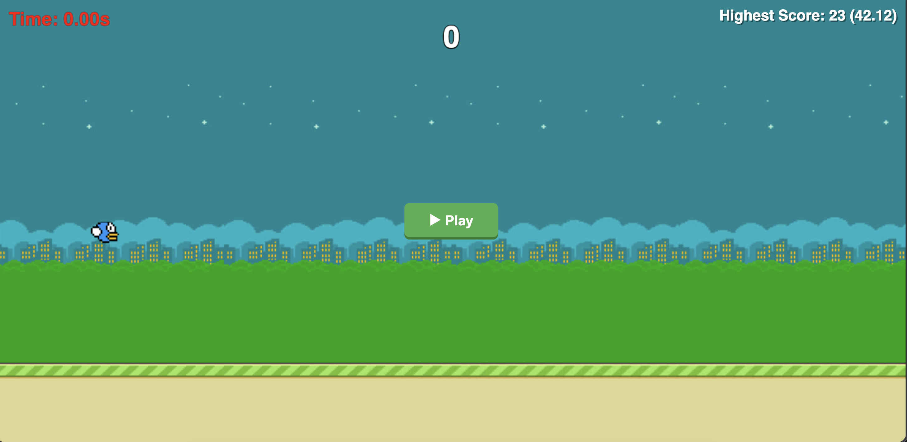
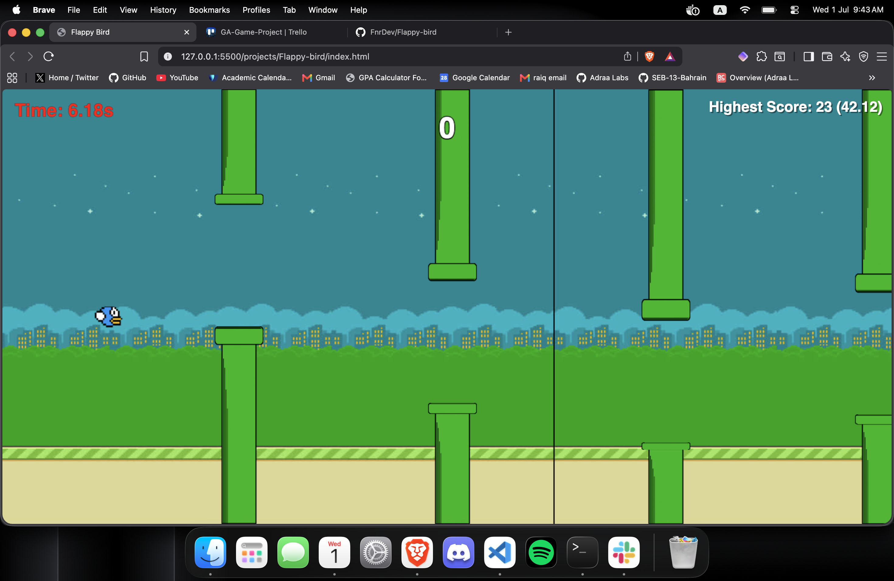
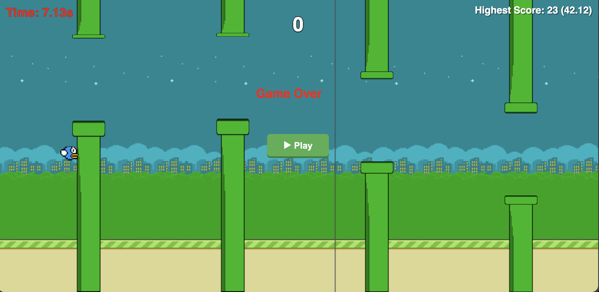

# Flappy Bird

## Game Link
https://fnrdev.github.io/Flappy-bird/

## Technologies Used
- HTML
- CSS
- JavaScript

## Description
Flappy Bird is a simple side-scrolling game where you control a bird that constantly falls due to gravity. Tapping makes it flap upward. The goal is to fly through gaps between green pipes without hitting them or the ground. Each pipe passed scores a point. One collision ends the game.

## User Stories
- As a user i should see a play button when i first play the game.
- As a user i should intreact with bird using keyboard keys
- As a user i should click space key to make the bird jump
- As a user when the bird hit the pole the game change to lose state
- As a user when i progress in the game the score should be incremented
- As a user the game score should be saved even when i close the game
- As a user when i progress in score the background (theme) should be changed to a differnt image

## Screenshots
- Start Game Screen

- Playing Game Screen

- Game Over Screen

## Future Enhancements
- Add reset button (resets both highest score timer & highest score)
- Add badges based on the highest score
- Add get ready countdown

## Credits
- [MDN keydown event](https://developer.mozilla.org/en-US/docs/Web/API/Element/keydown_event)
- [requestAnimationFrame VS setInterval](https://stackoverflow.com/questions/38709923/why-is-requestanimationframe-better-than-setinterval-or-settimeout)
